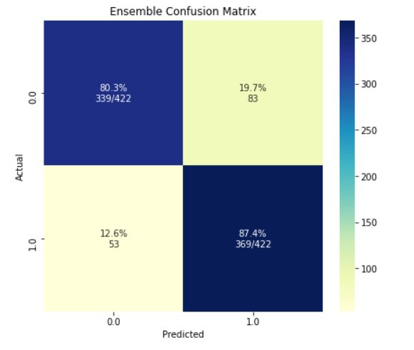

# Bank Loan Approval Predictor
This application predicts the whether the candidate is applicable of getting loan from the bank based on the following details : - 

1 - Applicant Income

2 - Co Applicant Income

3 - Loan Amount

4 - Loan Amount Term

5 - Credit History

6 - No. of Dependents

7 - Gender

8 - Marital Status

9 - Education

10 - Employment Type

11 - Property Location Type

Output variable :
1 - Loan Approval Status (Approved/Rejected)

## Application Link

Use the [link](https://bank-loan-pro.herokuapp.com/) to run the web application on Browser.

## Methodology
### Dataset
The Dataset is selected from kaggle.

### Data and Feature Engineering
#### Handling Missing Values
The missing values were replaced with mode of the column. Only the 'Loan Amount' column was imputed with median value so as to take into account the outliers too. 

#### Handling Class Imbalance
Class imbalance was handled using the SMOTE technique.

### New Features Imputation
Further few relevant features were added to the feature list :- 
#Total income
TotalIncome = ApplicantIncome  + CoapplicantIncome
 
#Monthly income
monthly_amount = LoanAmount/Loan_Amount_Term

#The income left after the monthly amount has been paid
left_income = TotalIncome - monthly_amount*1000

### Model Training

Multiple Machine Learning Models were trained to predict the class of the wine being tested using the above mentioned features. 

The following models were used (shown along with confusion matrix evaluation) :-

1 - LightGB Model

Accuracy = 81.49%

2 - XGBoost Model

Accuracy = 83.07%

3 - LightGB Model with KFold (K=5)

Accuracy = 86.26%

4 - XGBoost Model with KFold (K=5)

Accuracy = 83.89%

5 - Ensembling 

Expression used -> y_pred = alpha*(y_xgb_kfold) + (1 - alpha)*(y_lgb_kfold)

where y_xgb_kfold is y_pred from model 3 and y_lgb_kfold is y_pred from model 4

alpha selected -> 0.5

Accuracy = 83.89%

Therefore ensemble model provides best confusion metrics for model training. Hence selected.

| Model with Hyperparameters                                               | Score             | Score w Balancing |
| ------------------------------------------------------------------------ | ----------------- |------------------ |
| Logistic Regression (Unoptimized)                                        | (60.32%, 56.44%)  | (44.07%, 41.48%)  |
| Logistic Regression (C=1, multiclass='ovr',solver='newton-cg')           | (60.60%, 56.63%)  | (69.56%, 68.37%)  |
| Logistic Regression (C=36, multiclass='multinomial',solver='newton-cg')  | (62.46%, 57.20%)  | (92.43%, 92.04%)  |
| Support Vector Classifier (kernel='poly',C=100000)                       | (30.53%, 33.34%)  | (97.39%, 96.40%)  |
| Support Vector Classifier (kernel='linear',C=1)                          | (60.13%, 55.87%)  | (79.74%, 42.23%)  |

Therefore it was seen that balancing operation improved model performance. Hence further hyperparameter tuning was done with graphical study to obtain optimum parameters for Support Vector Classifier. 

Best fit model -> SVC(kernel='linear',C=100,decision_function_shape='ovo',gamma=0.01)
with score -> (99.72%, 99.81%)

### Application Deployment
The model is deployed using Django framework with templating for basic frontend. The Django application is deployed on Heroku.

Flowchart of application process :-

### Screenshots

